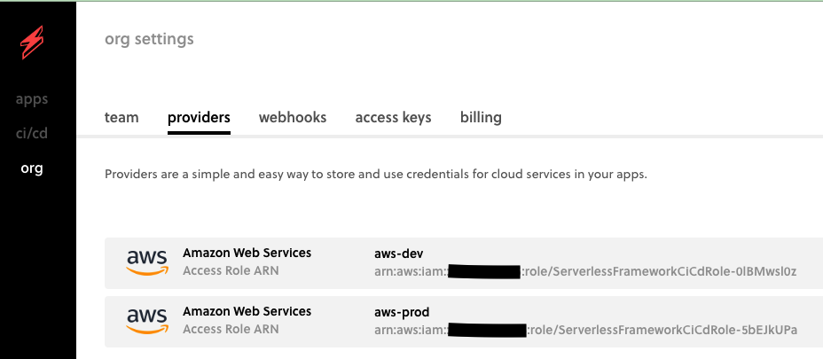

# reservation-tracker-rest-api

### CI/CD
#### Serverless Framework CI/CD
##### AWS Providers
AWS Accounts where resources will be deployed. In our example, we have 2 AWS accounts for `Dev` and `Prod`.
We link each AWS account to our Serverless account as providers.

##### Serverless Apps
Allows us to group common services for an application.
Stages or Deployment Profiles can be configured for a service. Each can be mapped to a provider.
In our example, `prod` and `dev` stages are created and will serve as our environments.

##### Github Configuration
Configure Github Connection and Repository to be managed by Serverless CI/CD.

##### Build and Deploy Service
This is where we configure which Stage/Environment a branch needs to be deployed to.
